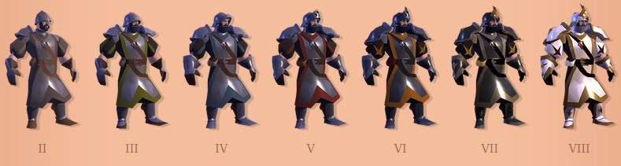
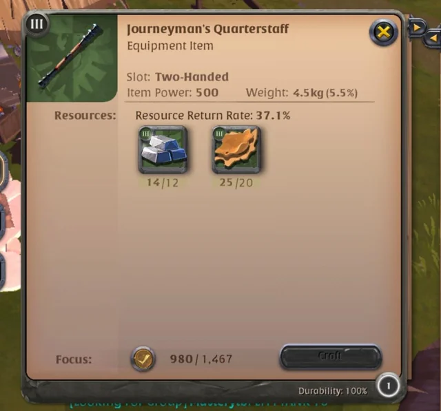

# Optimización de recursos y maximización de ganancias

| | |
|---|---|
| |  |

## Descripción del problema

Supongamos que dada una cantidad de dinero inicial se quieren comprar materiales para crear productos con ellos, posteriormente venderlos, y así idealmente recuperar la inversión total y obtener una ganancia adicional.

Particularmente, se quiere resolver este problema para el mercado del juego [Albion Online](https://albiononline.com/home), el cual es un juego multijugador masivo en línea que tiene un mercado **100% generado por los jugadores**, es decir, que toda la materia prima, todos los recursos refinados y todos los objetos del juego son recolectados, refinados y creados por los mismos jugadores, creando así un **mercado realista** que simula una **situación real para el problema a resolver**.

En este juego:

- Cada objeto tiene un **nivel del 1 al 8**, de modo que si se tiene una espada ancha esta puede ser nivel 1, 2, o hasta 8

- Así mismo, un objeto puede tener un **encantamiento nivel 1, 2, 3 o 4**

| Encantamiento 0 | Encantamiento 1 | Encantamiento 2 | Encantamiento 3 |
|---|---|---|---|
|  |  |  |  |

- Dependiendo del **nivel** y del **encantamiento** del objeto se necesitarán **materias primas refinadas** del **mismo nivel** y de la **misma categoría de encantamiento** para crearlo, por ejemplo, la espada ancha **nivel 4 con encantamiento 2** necesitará para crearse:
    - 16 lingotes **nivel 4 con encantamiento 2**
    - 8 de cuero **nivel 4 con encantamiento 2**

- También, **para crear un objeto **se debe utilizar una** estación de trabajo**, la cual pertenece a un jugador, y se debe **pagar una cuota por usarla** basada en en un precio asignado por el jugador propietario
- Al vender objetos en el mercado se debe **pagar un impuesto fijo de 8%** y, si se quiere crear una orden de venta (**poner tus artículos en exhibición**), se debe pagar un **2.5% de impuesto adicional**

Para este problema en particular se considerarán las materias primas refinadas **tablas, lingotes, tela y cuero**, con las cuales se pueden crear distintos tipos de armaduras y armas.

## Análisis del problema

Los **puntos clave** de este problema son:

1. Se quiere **maximizar la ganancia**, lo cual corresponde a las **ventas de los objetos creados menos** las **cuotas de creación** de los objetos **menos** el **costo de los materiales**

2. La **cantidad que se compre** de cada **tipo de  material** refinado debe ser **mayor o igual** que la **cantidad necesaria para crear** los objetos que requieran dicho **tipo de material**

3. El **costo total** de la operación, es decir, las **cuotas de creación de los objetos más** el **costo de los materiales**, debe ser **menor o igual** que el **presupuesto inicial** dedicado a la operación

## Propuesta de solución

## Uso de prototipo de la solución

## Atribución de imágenes

<a href="https://www.flaticon.com/free-icons/efficiency" title="efficiency icons">Efficiency icons created by Eucalyp - Flaticon</a>