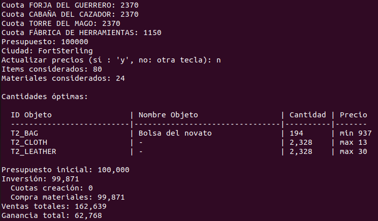
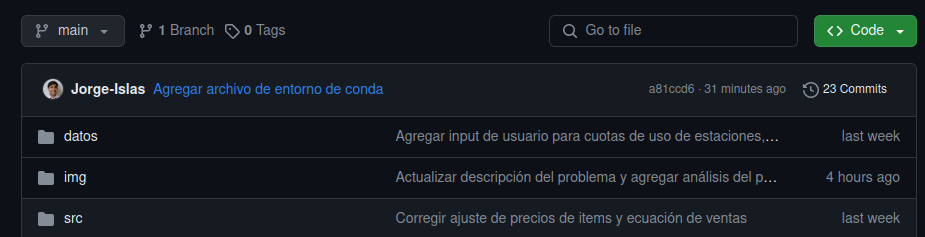

# Optimización de recursos y maximización de ganancias

| | |
|---|---|
| |  |

**Tabla de contenidos**

- [Descripción del problema](#descripción-del-problema)
- [Análisis del problema](#análisis-del-problema)
- [Propuesta de solución](#propuesta-de-solución)
    - [Función a maximizar](#función-a-maximizar)
    - [Restricciones del problema](#restricciones-del-problema)
- [Prototipo de solución](#prototipo-de-la-solución)
- [Atribución de imágenes](#atribución-de-imágenes)

## Descripción del problema

Supongamos que dada una cantidad de dinero inicial se quieren comprar materiales para crear productos con ellos, posteriormente venderlos, y así idealmente recuperar la inversión total y obtener una ganancia adicional.

Particularmente, se quiere resolver este problema para el mercado del juego [Albion Online](https://albiononline.com/home), el cual es un juego multijugador masivo en línea que tiene un mercado **100% generado por los jugadores**, es decir, que toda la materia prima, todos los recursos refinados y todos los objetos del juego son recolectados, refinados y creados por los mismos jugadores, creando así un **mercado realista** que simula una **situación real para el problema a resolver**.

En este juego:

- Cada objeto tiene un **nivel del 1 al 8**, de modo que si se tiene una espada ancha esta puede ser nivel 1, 2, o hasta 8


- Así mismo, un objeto puede tener un **encantamiento nivel 1, 2, 3 o 4**

| Encantamiento 0 | Encantamiento 1 | Encantamiento 2 | Encantamiento 3 |
|---|---|---|---|
|  |  |  |  |

- Dependiendo del **nivel** y del **encantamiento** del objeto se necesitarán **materias primas refinadas** del **mismo nivel** y de la **misma categoría de encantamiento** para crearlo, por ejemplo, la espada ancha **nivel 4 con encantamiento 2** necesitará para crearse:
    - 16 lingotes **nivel 4 con encantamiento 2**
    - 8 de cuero **nivel 4 con encantamiento 2**


- También, **para crear un objeto **se debe utilizar una** estación de trabajo**, la cual pertenece a un jugador, y se debe **pagar una cuota por usarla** basada en en un precio asignado por el jugador propietario
- Al vender objetos en el mercado se debe **pagar un impuesto fijo de 8%** y, si se quiere crear una orden de venta (**poner tus artículos en exhibición**), se debe pagar un **2.5% de impuesto adicional**

Para este problema en particular se considerarán las materias primas refinadas **tablas, lingotes, tela y cuero**, con las cuales se pueden crear distintos tipos de armaduras y armas.


## Análisis del problema

Los **puntos clave** de este problema son:

1. Se quiere **maximizar la ganancia**, lo cual corresponde a las **ventas de los objetos creados menos** las **cuotas de creación** de los objetos **menos** el **costo de los materiales**

2. La **cantidad que se compre** de cada **tipo de  material** refinado debe ser **mayor o igual** que la **cantidad necesaria para crear** los objetos que requieran dicho **tipo de material**

3. El **costo total** de la operación, es decir, las **cuotas de creación de los objetos más** el **costo de los materiales**, debe ser **menor o igual** que el **presupuesto inicial** dedicado a la operación

## Propuesta de solución

Este problema puede plantearse como un **problema de programación lineal**, donde "lineal" se refiere a que solamente habrá expresiones de **suma y multiplicación por números / escalares**, nada de exponentes, potencias, logarítmos, fracciones, etc. 

Este tipo de planteamiento consiste en **maximizar una función lineal** dadas varias **restricciones lineales** de tipo menor o igual (ej. $a+b+c\leq d$ ) o de tipo igualdad (ej. $a+b+c=d$ ). La forma de este tipo de problemas **con solo restricciones de menor o igual** es la siguiente:

$$
\text{max}\quad c_1x_1+c_2x_2+\cdots + c_nx_n
$$

$$
\qquad\text{dadas las restricciones:}
$$

$$
a_{11}x_1+a_{12}x_2+\cdots+a_{1n}x_n\leq b_1
$$

$$
a_{21}x_1+a_{22}x_2+\cdots+a_{2n}x_n\leq b_2
$$

$$\vdots$$

$$
a_{m1}x_1+a_{m2}x_2+\cdots+a_{mn}x_n\leq b_m
$$

$$
\text{con }\: x_1,x_2,\dots, x_n\geq 0
$$

### Función a maximizar
En este caso la **función a maximizar** está dada por:

- La suma de los **precios de venta de cada tipo de objeto** creados **multiplicados** por las **cantidades de objetos creados** de cada tipo de objeto, todo multiplicado por $1-\text{impuestos}$, es decir, $1 - (0.08 + 0.025)$

- **Menos** la suma de las **cuotas de creación de cada tipo de objeto** creados **multiplicados** por las **cantidades de objetos creados** de cada tipo de objeto

- **Menos** la suma de los **precios de compra de cada tipo de material** refinado **multiplicados** por las **cantidades de materiales compradas** de cada tipo de material refinado

### Restricciones del problema

En este caso hay dos tipos de restricciones, la restricción de dinero y las restricciones de materiales.

#### Restricción de dinero

La restricción de dinero está dada por:

- La suma de las **cuotas de creación de cada tipo de objeto** creados **multiplicados** por las **cantidades de objetos creados** de cada tipo de objeto

- **Más** la suma de los **precios de compra de cada tipo de material** refinado **multiplicados** por las **cantidades de materiales compradas** de cada tipo de material refinado

- Debe ser **menor o igual** al **presupuesto inicial** destinado a la operación

Ejemplo:

$$
\$175\cdot \text{bastones}_2 + \$350\cdot \text{arcos}_2 + \$14\cdot \text{tablas}_2 + \$13\cdot\text{lingotes}_2 \leq \$10000
$$

#### Restricciones de materiales

Las restricciones de materiales están dadas por:

- Las sumas de las cantidades necesarias de cada tipo de material para crear cada tipo de objeto

- Deben ser menores o iguales que las cantidades compradas de cada tipo de material

Ejemplo:

$$
16\cdot \text{bastones}_2 + 32\cdot\text{arcos}_2\leq \text{tablas}_2
$$

$$
8\cdot \text{bastones}_2 + 0\cdot\text{arcos}_2\leq \text{lingotes}_2
$$

#### Restricciones de variables

En este caso las variables representan cantidades enteras y mayores o iguales a cero, es decir, todas las variables son números naturales, pues no se pueden crear 1.5 espadas o -1 armaduras.

## Prototipo de la solución

Para obtener los precios del mercado se utilizó la **API** del proyecto [Albion Online Data roject](https://www.albion-online-data.com/), con la cual se pueden **obtener algunos datos** del mercado de Albion Online, como algunos precios de compra y de venta. Los precios que **no estén disponibles** mediante dicha API se le **piden al usuario**. Así mismo, los datos de las **cuotas de las estaciones de trabajo** se le piden al usuario, puesto que este debe **revisar manualmente** qué estación de trabajo es la más económica **dentro del juego**.

El prototipo funciona como una **CLI** (interfaz de consola de comandos o programa en la terminal), en la cual se le piden al usuario los datos que haya que rellenar o elegir, por ejemplo:

- **Qué categorías** de objetos **considerar** (no agregar categorías selecciona todas)

- **Qué categorías** de objetos **no considerar** (no agregar categorías impica no quitar nada)

- Las **cuotas de uso de cada tipo de estación de trabajo** de donde se vaya a realizar la operación

- El **presupuesto inicial** para la operación

- El **mercado de qué ciudad** del juego considerar (cada mercado de cada ciudad dentro del juego es independiente)

- Si **usar los datos guardados** o **actualizar los datos con la API** y rellenando los datos que falten

Al final se puede esperar una salida similar a la imagen siguiente:



Donde se detallan los tipos de objeto que se deben crear y los materiales que se deben comprar, junto con las cantidades correspondientes. También se muestran los precios mínimos de venta y máximos de compra para los objetos y los materiales, respectivamente. Al final, se muestra un desglose del costo total de la operación y de las ganancias totales.

### Usar el prototipo

Para poder usar el prototipo y seguir las instrucciones siguientes deberás tener `conda` instalado en tu dispositivo. Si no conoces `conda` aquí te dejo un recurso donde podrás ver lo básico de esta herramienta: [Conda tutorial básico](https://github.com/Jorge-Islas/Conda-tutorial-basico).

Primero debes **clonar este repositorio**. Puedes usar el **siguiente comando** o descargar un archivo `.zip` desde esta página dando clic en el botón verde que dice "**<> Code**" y elegir "**Download ZIP**" o "**Descargar ZIP**":



```
git clone https://github.com/Jorge-Islas/Optimizacion-de-recursos-y-ganancias.git
```

Después, usa el **siguiente comando** para **entrar a la carpeta** donde se encuentra el repositorio. Si descargaste el ZIP, **abre una terminal** y **entra en la carpeta** donde **descomprimiste** el ZIP y que se vean **todos los archivos del repositorio**

```
cd Optimizacion-de-recursos-y-ganancias/
```

Luego, crea un entorno de `conda` con el archivo `entorno.yml`

```
conda env create -f entorno.yml
```

Activa el entorno de `conda` que acabas de crear

```
conda activate optimizacion
```

Ejecuta el programa con el siguiente comando y sigue las instrucciones del programa

```
python main.py
```

## Atribución de imágenes

<a href="https://www.flaticon.com/free-icons/efficiency" title="efficiency icons">Efficiency icons created by Eucalyp - Flaticon</a>